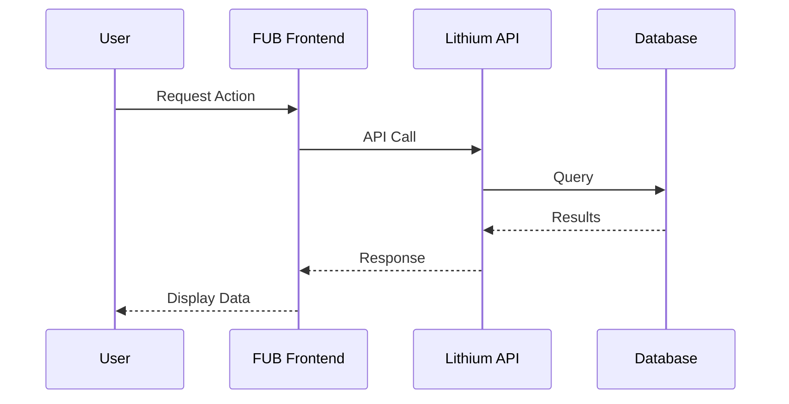
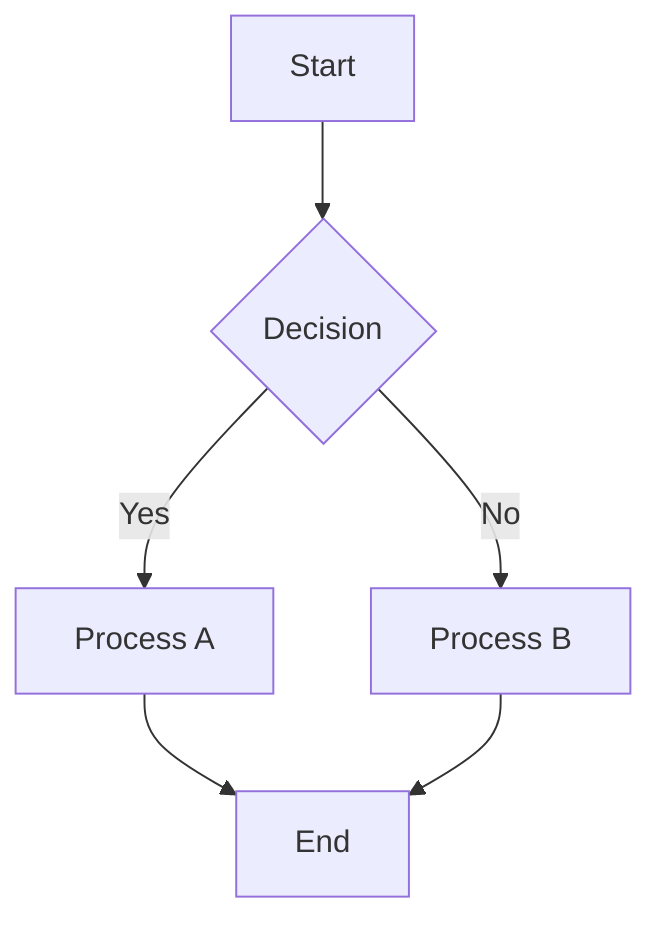
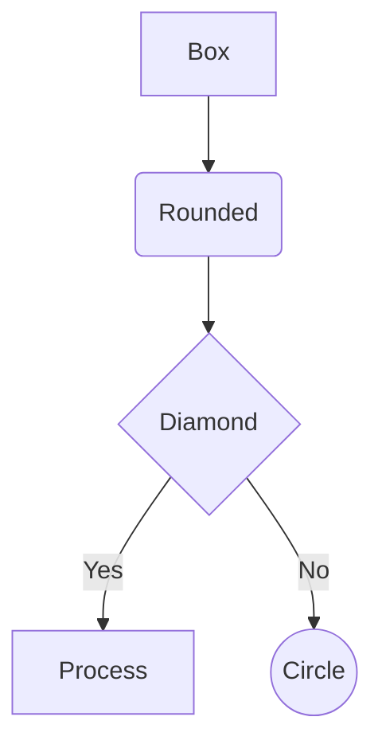
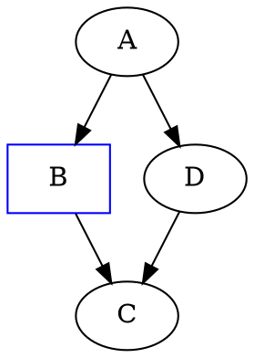

## Overview

Create and edit technical diagrams using Mermaid and Graphviz with proper syntax, rendering options, and export formats. Specializes in flowcharts, architecture diagrams, sequence diagrams, and database schemas for FUB development documentation.

🎨 **Diagram Templates**: [templates/diagram-templates.md](templates/diagram-templates.md)
🚀 **Advanced Patterns**: [advanced/advanced-patterns.md](advanced/advanced-patterns.md)
🔗 **Integration Workflows**: [workflows/integration-workflows.md](workflows/integration-workflows.md)
📋 **Reference Guide**: [reference/diagram-reference.md](reference/diagram-reference.md)

## Core Workflow

### Essential Operations (Most Common - 90% of Usage)

**1. Basic Diagram Creation**
```bash
# Create architecture diagram
diagramming --diagram_type="architecture" --content="FUB system overview with React frontend, Lithium backend, MySQL database"

# Create sequence diagram
diagramming --diagram_type="sequence" --content="User login flow with authentication and database validation"

# Create flowchart
diagramming --diagram_type="flowchart" --content="Property search process with filters and results"
```

**2. Quick Diagram Patterns**
```bash
# Database schema visualization
diagramming --diagram_type="erd" --content="users, contacts, properties tables with relationships"

# Process flow documentation
diagramming --diagram_type="flowchart" --format="mermaid" --style="forest"

# System architecture overview
diagramming --diagram_type="architecture" --format="mermaid" --output_file="system-overview"
```

### Common FUB Diagram Types

| Type | Purpose | Usage | Template |
|------|---------|-------|----------|
| **Architecture** | System overviews, component relationships | `--diagram_type="architecture"` | FUB service layers |
| **Sequence** | API interactions, user journeys | `--diagram_type="sequence"` | Auth flows, API calls |
| **Flowchart** | Process flows, decision trees | `--diagram_type="flowchart"` | Business logic |
| **ERD** | Database design, data relationships | `--diagram_type="erd"` | Schema documentation |
| **Class** | Object-oriented design, code structure | `--diagram_type="class"` | Model relationships |

→ **Complete templates and examples**: [templates/diagram-templates.md](templates/diagram-templates.md)

### Quick Start Templates

#### FUB Architecture Template


#### User Journey Template


#### Process Flow Template


→ **Complete template library**: [templates/diagram-templates.md](templates/diagram-templates.md)

## Rendering Commands

### Mermaid Rendering
```bash
# Install Mermaid CLI
npm install -g @mermaid-js/mermaid-cli

# Basic rendering
mmdc -i diagram.mmd -o diagram.png

# With theme and styling
mmdc -i diagram.mmd -o diagram.svg -t forest -b white
```

### Graphviz Rendering
```bash
# Install Graphviz
brew install graphviz  # macOS
apt-get install graphviz  # Ubuntu

# Basic rendering
dot -Tpng -o diagram.png diagram.dot

# Different layouts
neato -Tsvg -o diagram.svg diagram.dot    # spring model
circo -Tpng -o diagram.png diagram.dot    # circular layout
```

## Integration Patterns

### Cross-Skill Workflows

**Documentation → Diagramming:**
```bash
# Create diagrams from documentation
documentation-retrieval --query="system architecture" |
  diagramming --diagram_type="architecture" --format="mermaid"
```

**Planning → Diagramming:**
```bash
# Generate project timelines
planning-workflow --operation="export-timeline" |
  diagramming --diagram_type="gantt" --format="mermaid"
```

**Code Analysis → Diagramming:**
```bash
# Visualize code structure
serena-mcp --operation="analyze-classes" --target="app/Models/" |
  diagramming --diagram_type="class" --format="mermaid"
```

### Common Integration Workflows

| Skill | Integration | Output |
|-------|-------------|---------|
| `documentation-retrieval` | Convert docs to visual diagrams | Architecture, API flows |
| `planning-workflow` | Project timelines and dependencies | Gantt charts, milestones |
| `serena-mcp` | Code structure visualization | Class diagrams, dependencies |
| `support-investigation` | Issue flow mapping | Problem analysis diagrams |
| `confluence-management` | Documentation embedding | Visual documentation |

→ **Complete integration workflows**: [workflows/integration-workflows.md](workflows/integration-workflows.md)

## Advanced Patterns

### Complex Diagrams
- Multi-layered architecture visualization
- Event-driven system flows
- Custom styling and themes
- Interactive and animated diagrams
- Performance optimization for large diagrams

### Automation
- Automated diagram generation from code
- CI/CD integration for diagram validation
- Dynamic diagram updates from system changes
- Cross-platform diagram synchronization

### Enterprise Features
- Custom corporate styling
- Accessibility compliance (WCAG)
- Version control integration
- Diagram quality metrics and monitoring

→ **Advanced implementation patterns**: [advanced/advanced-patterns.md](advanced/advanced-patterns.md)

## Troubleshooting

### Common Issues
| Issue | Solution |
|-------|----------|
| **Syntax errors** | Validate against reference syntax |
| **Rendering failures** | Check CLI installation and file paths |
| **Layout problems** | Try different layout directions or engines |
| **Text overlapping** | Use shorter labels or line breaks |
| **Theme issues** | Verify theme name and compatibility |

### Performance Optimization
- Use CSS classes instead of inline styles
- Simplify complex diagrams by splitting them
- Choose appropriate layout engines for diagram type
- Optimize node shapes and edge routing

→ **Complete troubleshooting guide**: [reference/diagram-reference.md](reference/diagram-reference.md)

## Quick Reference

### Mermaid Syntax Quick Reference


### Graphviz DOT Quick Reference


### Common Commands
```bash
# Validate syntax
mmdc -i diagram.mmd -o /dev/null
dot -Tsvg -o /dev/null diagram.dot

# Render multiple formats
mmdc -i diagram.mmd -o diagram.png
mmdc -i diagram.mmd -o diagram.svg
```

→ **Complete syntax reference**: [reference/diagram-reference.md](reference/diagram-reference.md)

## Preconditions

- Must have Mermaid CLI installed (`npm install -g @mermaid-js/mermaid-cli`) for Mermaid diagrams
- Must have Graphviz installed (`brew install graphviz` or `apt-get install graphviz`) for DOT diagrams
- Must have write access to output directory for file generation
- Must have network access for theme and dependency downloads
- Must validate diagram syntax before rendering large batches

## Refusal Conditions

The skill must refuse if:
- Mermaid CLI is not installed and Mermaid diagrams are requested
- Graphviz is not installed and DOT diagrams are requested
- Output directory is not writable or accessible
- Diagram syntax is invalid and cannot be corrected
- Requested diagram type is not supported by chosen format
- File permissions prevent reading input files or writing output files

When refusing, explain which requirement prevents execution and provide specific installation commands or configuration steps to resolve the issue, including platform-specific installation instructions and permission requirements.

## Supporting Infrastructure

→ **Advanced patterns and complex implementations**: [advanced/advanced-patterns.md](advanced/advanced-patterns.md)
→ **Comprehensive templates and quick start guides**: [templates/diagram-templates.md](templates/diagram-templates.md)

This skill provides comprehensive diagramming capabilities while maintaining seamless integration with FUB's development and documentation ecosystem.