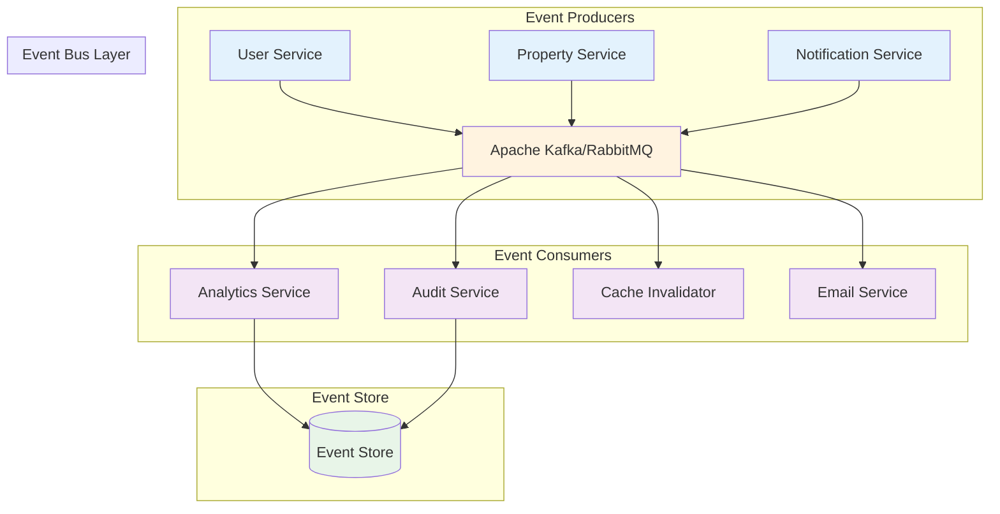
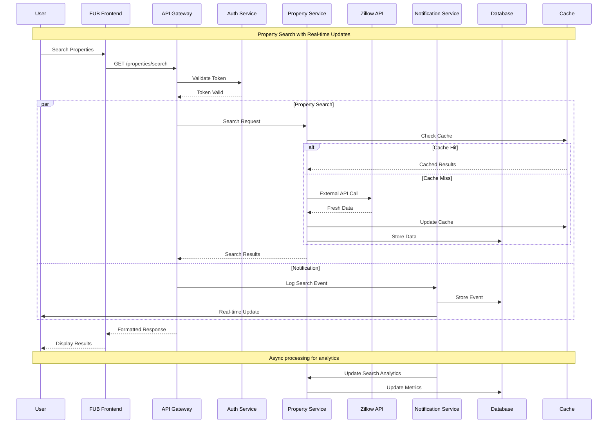
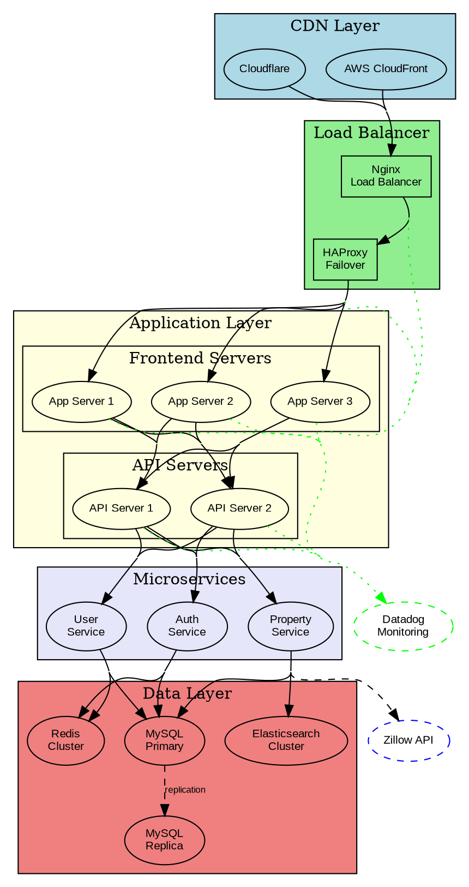
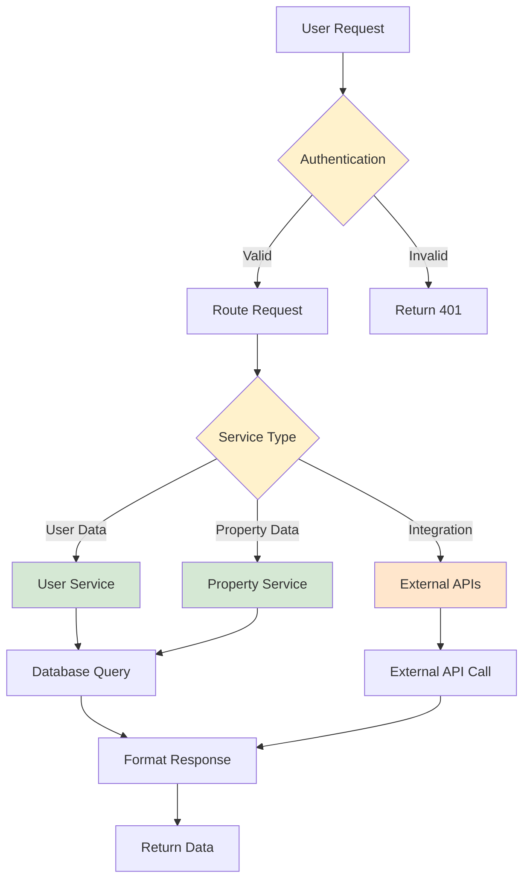
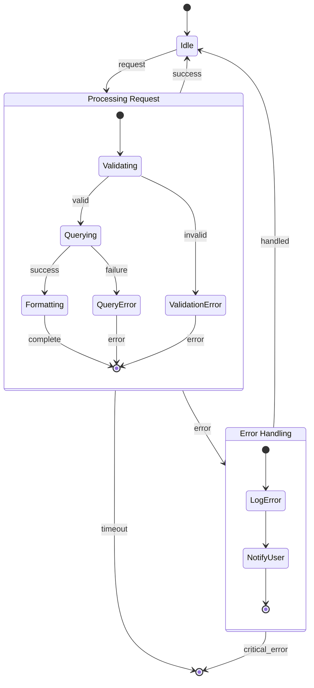
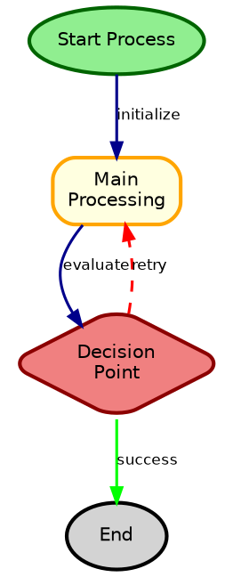
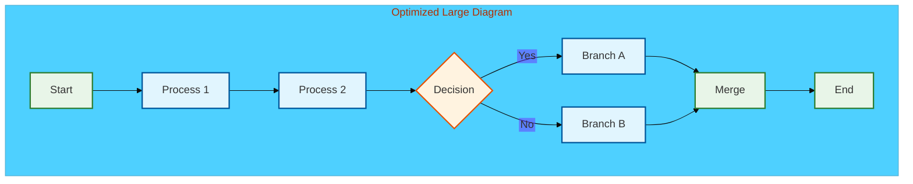

## Advanced Diagramming Patterns and Implementation

### Complex Architecture Patterns

#### Microservices Architecture with Service Mesh


#### Event-Driven Architecture Pattern


### Advanced Sequence Patterns

#### Complex Multi-System Integration Flow


### Advanced Graphviz Patterns

#### Complex System Topology


### Interactive and Animated Diagrams

#### Progressive Disclosure Architecture


#### State Machine with Transitions


### Custom Styling and Themes

#### Custom Mermaid Theme Configuration
```javascript
// Custom theme configuration
const customTheme = {
    theme: 'base',
    themeVariables: {
        primaryColor: '#ff6b35',
        primaryTextColor: '#ffffff',
        primaryBorderColor: '#ff8c42',
        lineColor: '#f39c12',
        secondaryColor: '#006ba6',
        tertiaryColor: '#0582ca',
        background: '#ffffff',
        mainBkg: '#f8f9fa',
        secondBkg: '#e9ecef',
        tertiaryBkg: '#dee2e6'
    }
};

// Apply theme to diagram
mermaid.initialize({
    startOnLoad: true,
    theme: customTheme,
    flowchart: {
        useMaxWidth: true,
        htmlLabels: true
    }
});
```

#### Advanced DOT Styling


### Automation and Scripting

#### Automated Diagram Generation Script
```bash
#!/bin/bash
# automated-diagram-generation.sh

set -e

DIAGRAM_DIR="./diagrams"
OUTPUT_DIR="./output"
FORMATS=("png" "svg" "pdf")

# Create output directory
mkdir -p "$OUTPUT_DIR"

# Function to render Mermaid diagrams
render_mermaid() {
    local input_file="$1"
    local basename=$(basename "$input_file" .mmd)

    echo "Rendering Mermaid: $input_file"

    for format in "${FORMATS[@]}"; do
        mmdc -i "$input_file" -o "$OUTPUT_DIR/${basename}.$format" \
             --theme forest --backgroundColor white
    done
}

# Function to render Graphviz diagrams
render_graphviz() {
    local input_file="$1"
    local basename=$(basename "$input_file" .dot)

    echo "Rendering Graphviz: $input_file"

    dot -Tpng -o "$OUTPUT_DIR/${basename}.png" "$input_file"
    dot -Tsvg -o "$OUTPUT_DIR/${basename}.svg" "$input_file"
    dot -Tpdf -o "$OUTPUT_DIR/${basename}.pdf" "$input_file"
}

# Process all Mermaid files
find "$DIAGRAM_DIR" -name "*.mmd" -type f | while read -r file; do
    render_mermaid "$file"
done

# Process all Graphviz files
find "$DIAGRAM_DIR" -name "*.dot" -type f | while read -r file; do
    render_graphviz "$file"
done

echo "All diagrams rendered successfully to $OUTPUT_DIR"
```

#### Dynamic Diagram Generation
```python
#!/usr/bin/env python3
# dynamic_architecture_diagram.py

import json
import sys
from pathlib import Path

def generate_architecture_diagram(config_file):
    """Generate architecture diagram from JSON configuration"""

    with open(config_file, 'r') as f:
        config = json.load(f)

    mermaid_content = """architecture-beta
"""

    # Generate groups
    for group in config.get('groups', []):
        group_type = group.get('type', 'cloud')
        mermaid_content += f'    group {group["name"]}({group_type})[{group["label"]}]\n'

    mermaid_content += "\n"

    # Generate services
    for service in config.get('services', []):
        service_type = service.get('type', 'server')
        group_name = service.get('group', '')
        mermaid_content += f'    service {service["name"]}({service_type})[{service["label"]}] in {group_name}\n'

    mermaid_content += "\n"

    # Generate connections
    for connection in config.get('connections', []):
        from_service = connection['from']
        to_service = connection['to']
        label = connection.get('label', '')
        direction_from = connection.get('direction_from', 'B')
        direction_to = connection.get('direction_to', 'T')

        if label:
            mermaid_content += f'    {from_service}:{direction_from} --> {to_service}:{direction_to} : {label}\n'
        else:
            mermaid_content += f'    {from_service}:{direction_from} --> {to_service}:{direction_to}\n'

    return mermaid_content

if __name__ == "__main__":
    if len(sys.argv) != 2:
        print("Usage: python3 dynamic_architecture_diagram.py config.json")
        sys.exit(1)

    config_file = sys.argv[1]
    diagram_content = generate_architecture_diagram(config_file)

    # Write to output file
    output_file = Path(config_file).stem + "_architecture.mmd"
    with open(output_file, 'w') as f:
        f.write(diagram_content)

    print(f"Architecture diagram generated: {output_file}")
```

### Performance Optimization Patterns

#### Large Diagram Optimization


### CI/CD Integration Patterns

#### GitLab CI Pipeline for Diagram Validation
```yaml
# .gitlab-ci.yml
stages:
  - validate
  - render
  - deploy

validate-diagrams:
  stage: validate
  image: node:18
  script:
    - npm install -g @mermaid-js/mermaid-cli
    - find . -name "*.mmd" -exec mmdc -i {} -o /dev/null \;
    - find . -name "*.dot" -exec dot -Tsvg -o /dev/null {} \;
  only:
    changes:
      - "**/*.mmd"
      - "**/*.dot"

render-diagrams:
  stage: render
  image: node:18
  before_script:
    - npm install -g @mermaid-js/mermaid-cli
    - apt-get update && apt-get install -y graphviz
  script:
    - mkdir -p rendered
    - find . -name "*.mmd" -exec mmdc -i {} -o rendered/{/.}.png \;
    - find . -name "*.dot" -exec dot -Tpng -o rendered/{/.}.png {} \;
  artifacts:
    paths:
      - rendered/
    expire_in: 1 week
  only:
    changes:
      - "**/*.mmd"
      - "**/*.dot"

deploy-documentation:
  stage: deploy
  script:
    - rsync -av rendered/ $DOC_SERVER:/var/www/diagrams/
  only:
    - main
```

This comprehensive guide provides advanced patterns for creating sophisticated, maintainable, and automated diagrams that integrate seamlessly with FUB's development workflows.