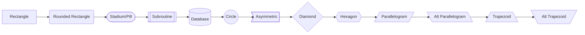
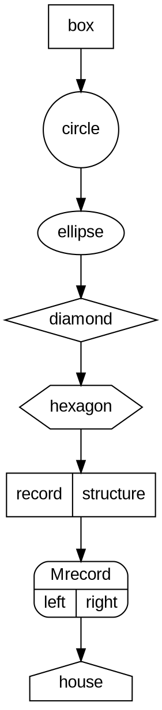
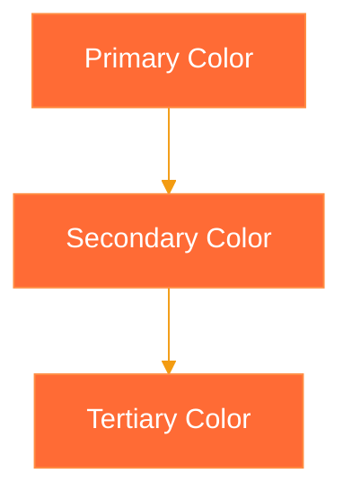
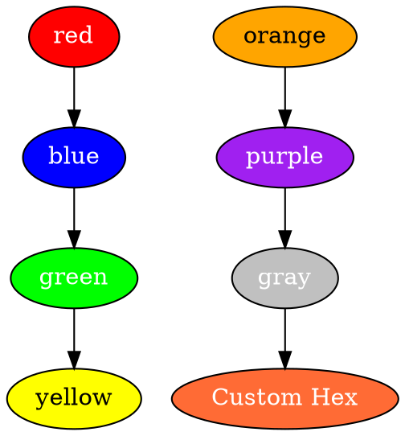
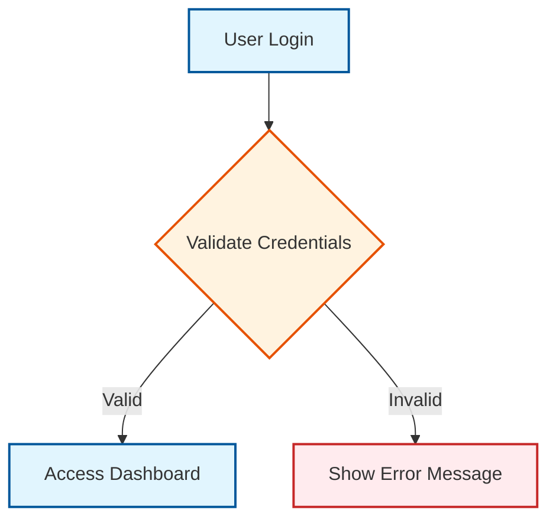
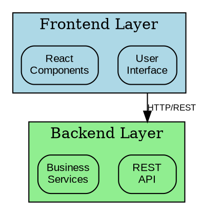
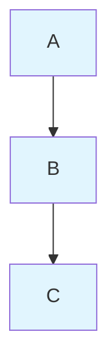
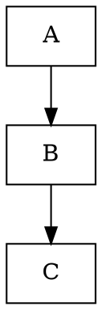
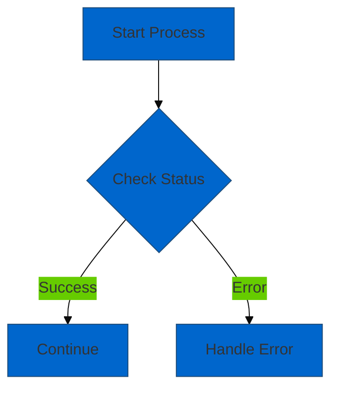

## Diagram Reference and Troubleshooting Guide

### Quick Syntax Reference

#### Mermaid Syntax Cheat Sheet

| Diagram Type | Syntax | Common Elements |
|--------------|--------|-----------------|
| **Flowchart** | `flowchart TD` | `A[Box] --> B{Decision}` |
| **Sequence** | `sequenceDiagram` | `A->>B: Message` |
| **Architecture** | `architecture-beta` | `service name(type)[Label]` |
| **ERD** | `erDiagram` | `USER \|\|--o{ ORDER` |
| **Class** | `classDiagram` | `class User { +name }` |
| **State** | `stateDiagram-v2` | `[*] --> State1` |
| **Gantt** | `gantt` | `task1 :2024-01-01, 7d` |
| **Git** | `gitgraph` | `commit id: "Initial"` |

#### Graphviz DOT Syntax Cheat Sheet

| Element | Syntax | Example |
|---------|--------|---------|
| **Graph** | `digraph Name { }` | `digraph G { A -> B; }` |
| **Node** | `node [attributes]` | `node [shape=box, color=red]` |
| **Edge** | `A -> B [label="text"]` | `A -> B [color=blue]` |
| **Subgraph** | `subgraph cluster_name { }` | `subgraph cluster_0 { A; B; }` |
| **Attributes** | `attribute=value` | `shape=circle, color=red` |

### Node Shapes and Styles Reference

#### Mermaid Node Shapes


#### Graphviz Node Shapes


### Color and Theme Reference

#### Mermaid Color Schemes


#### Graphviz Color Reference


### Common Patterns and Best Practices

#### Mermaid Best Practices
1. **Use descriptive IDs**: `userAuth` instead of `A`
2. **Consistent styling**: Define CSS classes for reusability
3. **Proper spacing**: Use line breaks for readability
4. **Theme consistency**: Stick to one theme per diagram
5. **Accessibility**: Add `accDescr` for screen readers



#### Graphviz Best Practices
1. **Use clusters for grouping**: `subgraph cluster_name`
2. **Consistent node styling**: Define default attributes
3. **Proper edge routing**: Use `rankdir`, `compound`
4. **Readable labels**: Use `\n` for line breaks
5. **Logical hierarchy**: Order nodes by importance



### Troubleshooting Common Issues

#### Mermaid Rendering Issues

| Issue | Cause | Solution |
|-------|-------|----------|
| **Diagram not rendering** | Syntax error | Check console for errors, validate syntax |
| **Text overlapping** | Long labels | Use `\n` for line breaks or shorter text |
| **Layout issues** | Wrong direction | Try different `rankdir` (`TD`, `LR`, `BT`, `RL`) |
| **Missing connections** | Incorrect node IDs | Ensure node IDs match exactly |
| **Styling not applied** | CSS class errors | Validate CSS class names and definitions |
| **Theme conflicts** | Multiple themes | Use only one theme configuration |

#### Graphviz Rendering Issues

| Issue | Cause | Solution |
|-------|-------|----------|
| **Syntax errors** | Invalid DOT syntax | Validate with `dot -Tsvg file.dot` |
| **Overlapping nodes** | Poor layout | Try different engines (`neato`, `circo`, `fdp`) |
| **Missing edges** | Undeclared nodes | Declare all nodes before using |
| **Cluster issues** | Wrong cluster syntax | Use `subgraph cluster_name` format |
| **Font problems** | Missing fonts | Specify available system fonts |
| **Large file size** | Complex diagrams | Simplify or split into multiple diagrams |

### Error Messages and Solutions

#### Common Mermaid Errors
```javascript
// Error: "Parse error on line X"
// Cause: Syntax error in diagram definition
// Solution: Check syntax against documentation

// Error: "Cannot read property of undefined"
// Cause: Incorrect node reference
// Solution: Ensure all referenced nodes are defined

// Error: "Theme not found"
// Cause: Invalid theme name
// Solution: Use valid theme names: 'default', 'forest', 'dark', 'neutral'

// Error: "Diagram definition not found"
// Cause: Missing or empty diagram content
// Solution: Provide valid diagram definition
```

#### Common Graphviz Errors
```bash
# Error: "syntax error in line X near 'Y'"
# Cause: Invalid DOT syntax
# Solution: Check DOT syntax specification

# Error: "node 'X' not found"
# Cause: Referenced undefined node
# Solution: Define node before referencing

# Error: "trouble in init_rank"
# Cause: Circular dependencies
# Solution: Check for cycles in graph

# Error: "can't open font"
# Cause: Font not found
# Solution: Use available system fonts or specify font path
```

### Performance Optimization Guidelines

#### Large Diagram Optimization

**Mermaid Optimization:**


**Graphviz Optimization:**


#### File Size Management
- **Mermaid**: Use CSS classes instead of inline styles
- **Graphviz**: Minimize attribute repetition
- **Both**: Split complex diagrams into multiple files
- **Export**: Use SVG for scalability, PNG for compatibility

### Accessibility Guidelines

#### Screen Reader Support


#### Color Accessibility
- **Contrast**: Ensure sufficient color contrast (4.5:1 minimum)
- **Color blindness**: Don't rely solely on color to convey information
- **Alternative indicators**: Use shapes, patterns, or labels alongside color

### Integration Testing Validation

#### Diagram Validation Script
```bash
#!/bin/bash
# validate-diagrams.sh

validate_mermaid() {
    local file="$1"
    echo "Validating Mermaid file: $file"

    # Syntax check
    if mmdc -i "$file" -o /dev/null; then
        echo "✅ Syntax valid"
    else
        echo "❌ Syntax error"
        return 1
    fi

    # Accessibility check
    if grep -q "accDescr\|accTitle" "$file"; then
        echo "✅ Accessibility metadata found"
    else
        echo "⚠️  Consider adding accessibility metadata"
    fi
}

validate_graphviz() {
    local file="$1"
    echo "Validating Graphviz file: $file"

    # Syntax check
    if dot -Tsvg -o /dev/null "$file"; then
        echo "✅ Syntax valid"
    else
        echo "❌ Syntax error"
        return 1
    fi

    # Check for proper structure
    if grep -q "digraph\|graph" "$file"; then
        echo "✅ Graph structure valid"
    else
        echo "❌ Missing graph declaration"
        return 1
    fi
}

# Validate all diagram files
find . -name "*.mmd" -exec bash -c 'validate_mermaid "$0"' {} \;
find . -name "*.dot" -exec bash -c 'validate_graphviz "$0"' {} \;
```

### Version Control Best Practices

#### Git Configuration for Diagrams
```gitattributes
# .gitattributes
*.mmd linguist-language=Mermaid
*.dot linguist-language=DOT

# Treat rendered images as binary
*.png binary
*.jpg binary
*.svg binary
```

#### Pre-commit Hooks
```bash
#!/bin/sh
# .git/hooks/pre-commit

echo "Validating diagram files..."

# Check for diagram syntax
for file in $(git diff --cached --name-only | grep -E '\.(mmd|dot)$'); do
    if [[ "$file" == *.mmd ]]; then
        mmdc -i "$file" -o /dev/null || {
            echo "Error: Invalid Mermaid syntax in $file"
            exit 1
        }
    elif [[ "$file" == *.dot ]]; then
        dot -Tsvg -o /dev/null "$file" || {
            echo "Error: Invalid Graphviz syntax in $file"
            exit 1
        }
    fi
done

echo "All diagrams validated successfully"
```

### Standards Compliance Checklist

#### Diagram Quality Standards
- [ ] Syntax is valid and error-free
- [ ] Consistent styling and color scheme
- [ ] Proper accessibility metadata included
- [ ] Clear, descriptive labels and titles
- [ ] Appropriate complexity level for audience
- [ ] Version controlled with meaningful commit messages
- [ ] Documentation includes context and purpose
- [ ] Integration with related documentation
- [ ] Regular updates and maintenance schedule
- [ ] Cross-platform compatibility verified

This comprehensive reference ensures consistent, high-quality diagram creation and maintenance aligned with FUB's technical documentation standards.