# Diagramming Syntax Reference

## Mermaid Syntax Guide

### Flowchart Shapes and Connections

**Node Shapes:**
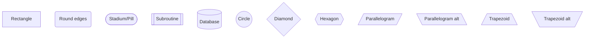

**Arrow Types:**
```mermaid
flowchart TD
    A --> B    %% Arrow
    C --- D     %% Line
    E -.-> F    %% Dotted arrow
    G ==> H     %% Thick arrow
    I -.- J     %% Dotted line
    K === L     %% Thick line
```

**Arrow Labels:**
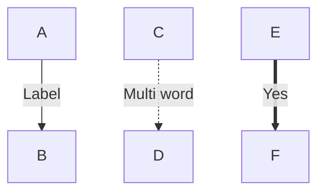

### Sequence Diagrams

**Participants and Messages:**
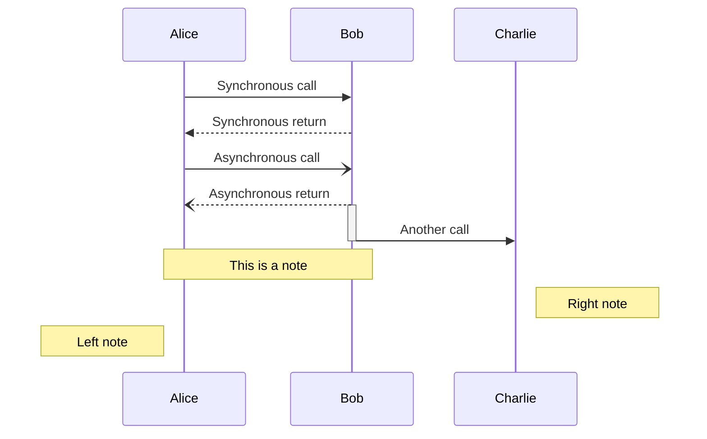

**Loops and Alternatives:**
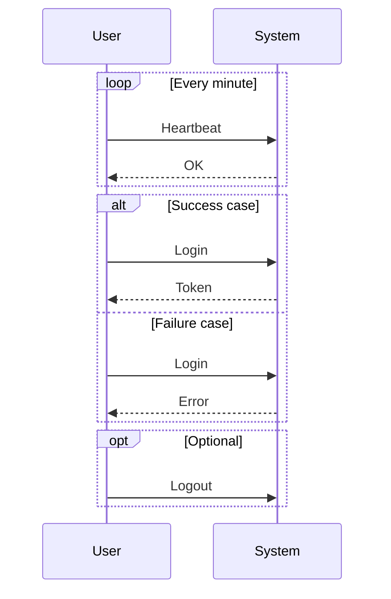

### Entity Relationship Diagrams

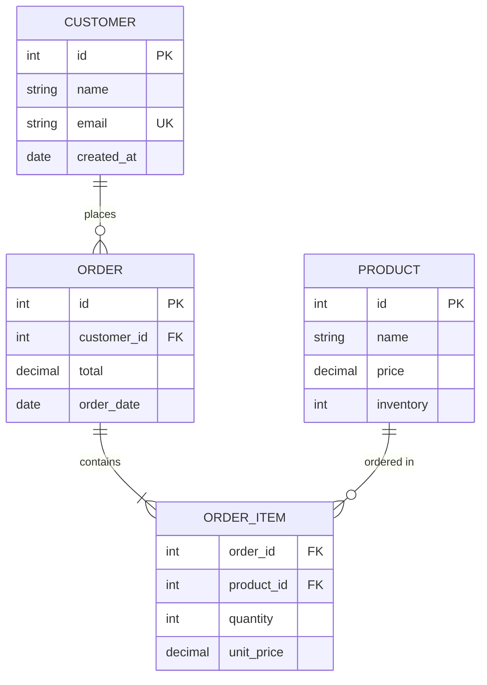

**Relationship Types:**
- `||--||` : One to one
- `||--o{` : One to zero or many
- `||--|{` : One to one or many
- `}o--||` : Zero or many to one
- `}|--|{` : One or many to one or many

### Class Diagrams

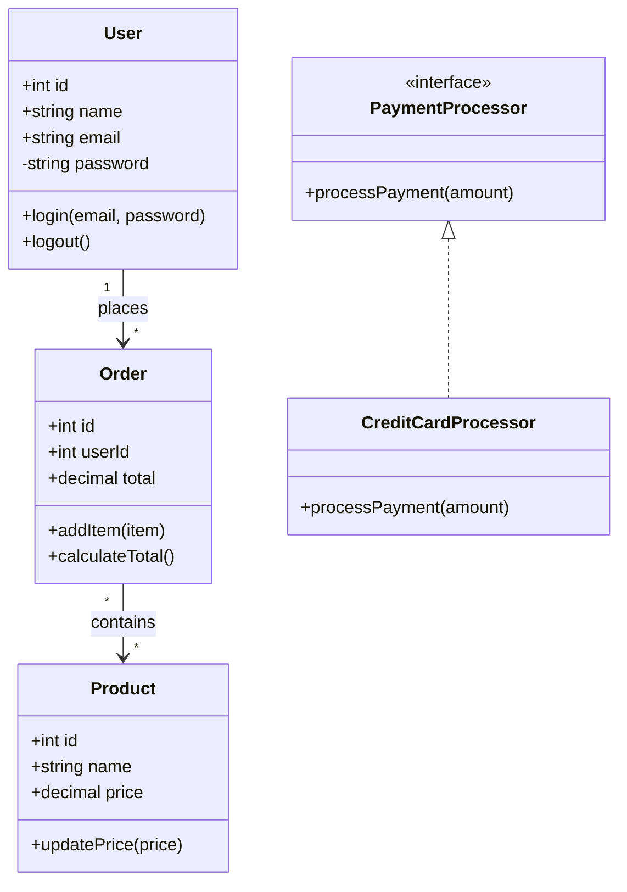

### Git Graphs

```mermaid
gitgraph
    commit id: "Initial"
    branch develop
    checkout develop
    commit id: "Feature A"
    commit id: "Feature B"
    checkout main
    merge develop
    commit id: "Release 1.0"
    branch hotfix
    checkout hotfix
    commit id: "Critical fix"
    checkout main
    merge hotfix
    commit id: "Release 1.0.1"
```

## Graphviz (DOT) Syntax Guide

### Basic Graph Structure

**Directed Graph (digraph):**
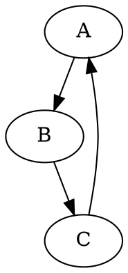

**Undirected Graph (graph):**
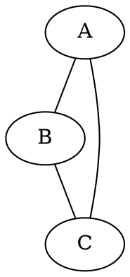

### Node and Edge Attributes

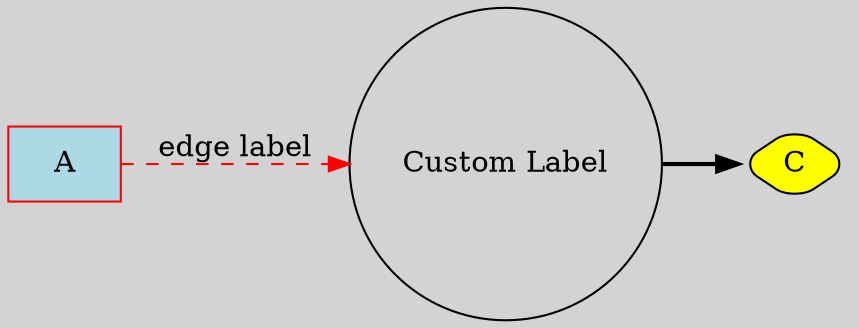

### Common Node Shapes

```dot
digraph shapes {
    box [shape=box];
    circle [shape=circle];
    ellipse [shape=ellipse];
    diamond [shape=diamond];
    triangle [shape=triangle];
    pentagon [shape=pentagon];
    hexagon [shape=hexagon];
    octagon [shape=octagon];
    house [shape=house];
    invhouse [shape=invhouse];
    trapezium [shape=trapezium];
    invtrapezium [shape=invtrapezium];
    parallelogram [shape=parallelogram];
    record [shape=record, label="field1|field2|field3"];
    Mrecord [shape=Mrecord, label="field1|{field2a|field2b}|field3"];
}
```

### Subgraphs and Clusters

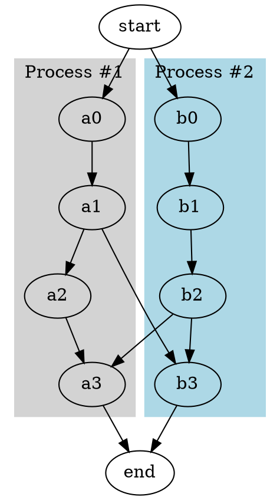

### Layout Directions

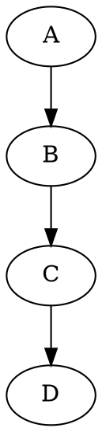

### Record Structures

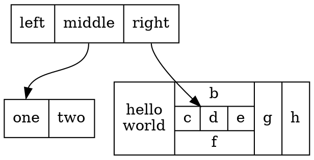

## Advanced Features

### Mermaid Themes and Styling

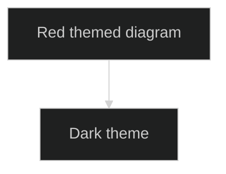

### Graphviz Advanced Layouts

**For large hierarchical graphs:**
```dot
digraph G {
    layout=dot;     // Hierarchical (default)
    // layout=neato; // Spring model
    // layout=fdp;   // Force-directed
    // layout=sfdp;  // Large graphs
    // layout=twopi; // Radial
    // layout=circo; // Circular
}
```

### HTML-like Labels in Graphviz

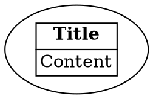