## Diagram Templates and Basic Patterns

### Mermaid Diagram Templates

#### Architecture Diagram Template


#### Flowchart Template
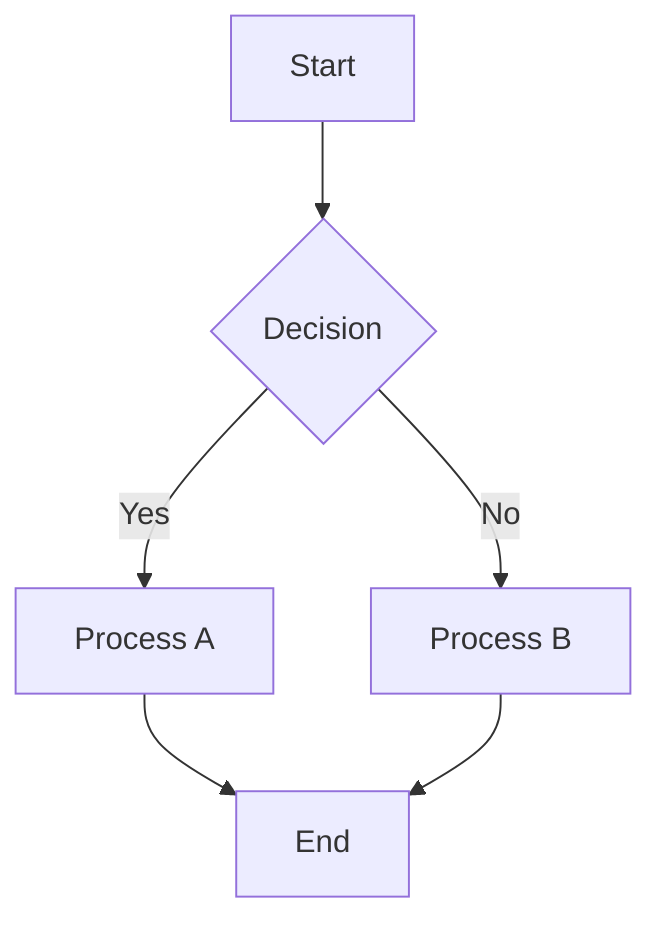

#### Sequence Diagram Template
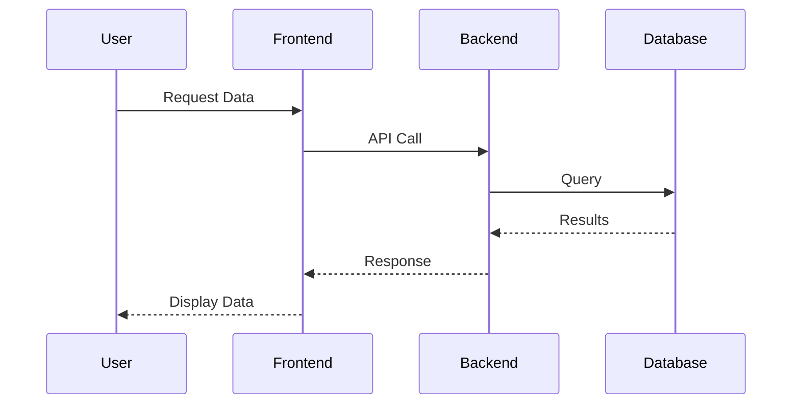

#### Entity Relationship Diagram Template
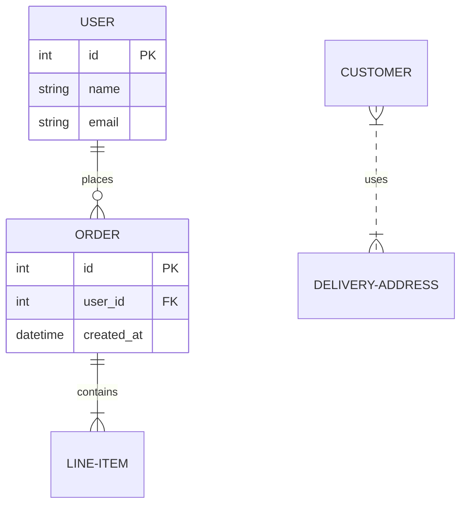

#### Gantt Chart Template
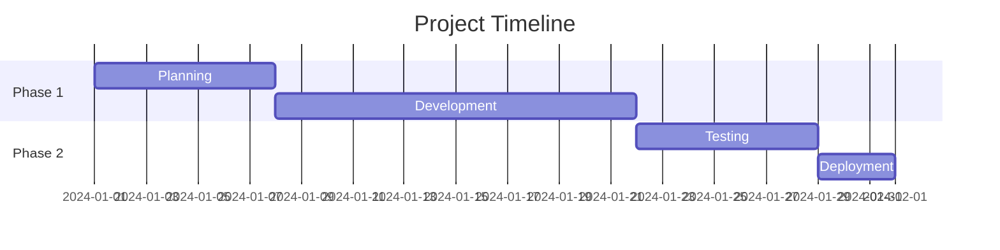

#### Git Graph Template
```mermaid
gitgraph
    commit id: "Initial"
    branch feature
    checkout feature
    commit id: "Feature A"
    commit id: "Feature B"
    checkout main
    commit id: "Hotfix"
    merge feature
    commit id: "Release"
```

#### State Diagram Template
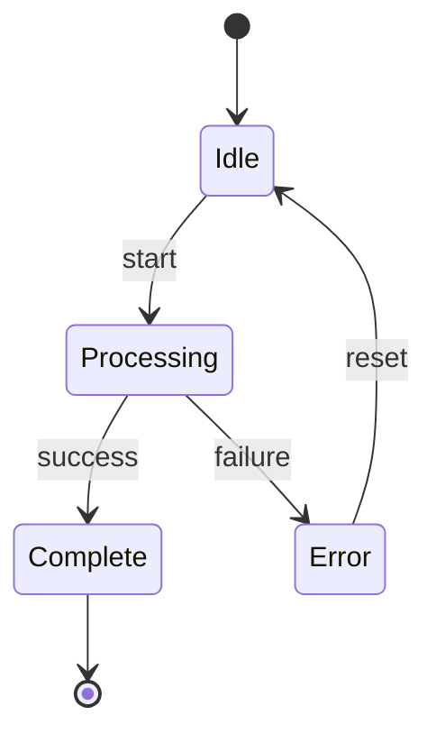

#### Class Diagram Template
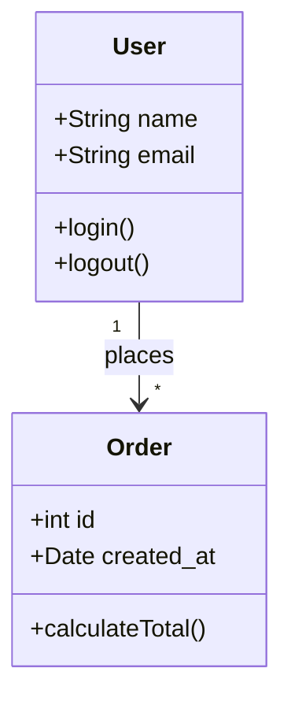

### Graphviz DOT Templates

#### Simple Directed Graph Template
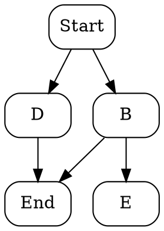

#### System Architecture Template
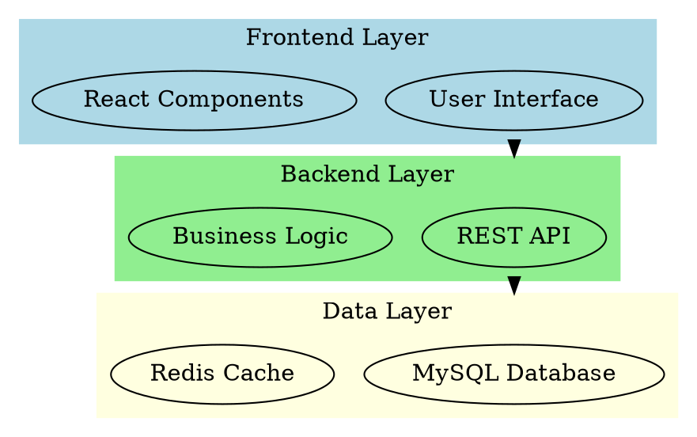

#### Process Flow Template
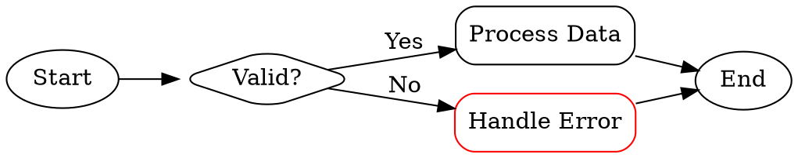

### FUB-Specific Templates

#### FUB Architecture Overview


#### FUB Integration Flow
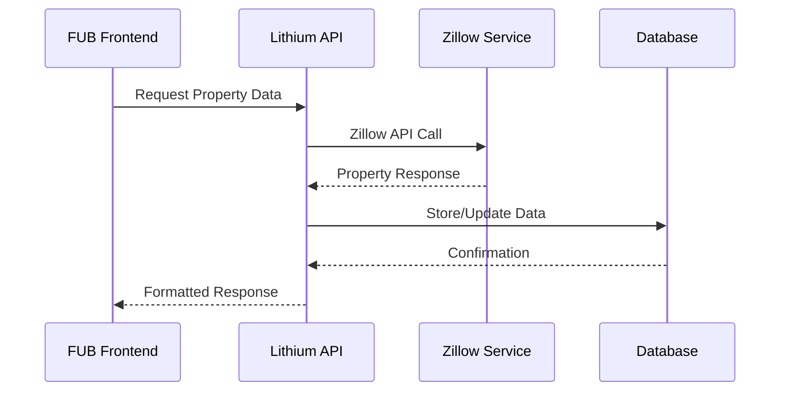

#### FUB Database Schema
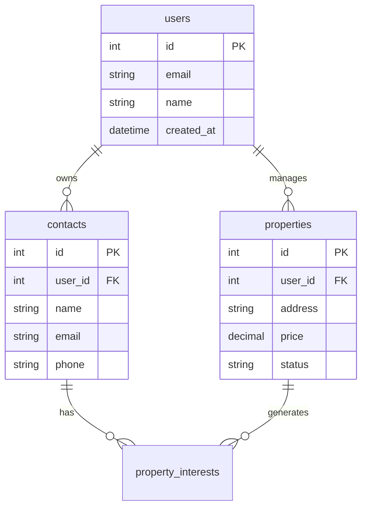

### Quick Reference Patterns

#### Common Node Shapes (Mermaid)
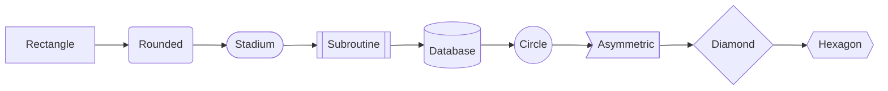

#### Common Edge Types
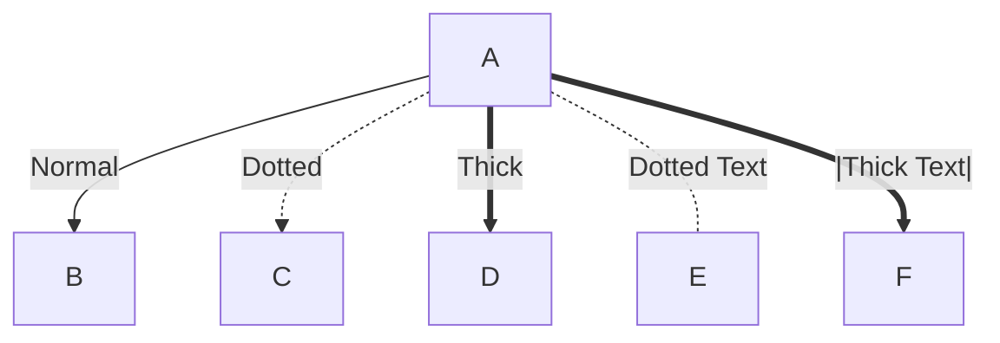

#### Color and Styling
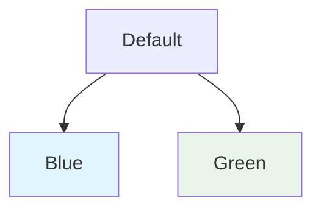

### Rendering Commands Reference

#### Mermaid CLI Commands
```bash
# Install Mermaid CLI
npm install -g @mermaid-js/mermaid-cli

# Render to PNG
mmdc -i diagram.mmd -o diagram.png

# Render to SVG with theme
mmdc -i diagram.mmd -o diagram.svg -t forest

# Batch render
mmdc -i diagrams/ -o output/
```

#### Graphviz Commands
```bash
# Install Graphviz
brew install graphviz  # macOS
apt-get install graphviz  # Ubuntu

# Render DOT to PNG
dot -Tpng -o diagram.png diagram.dot

# Render to SVG
dot -Tsvg -o diagram.svg diagram.dot

# Different layout engines
neato -Tpng -o diagram.png diagram.dot    # spring model
circo -Tpng -o diagram.png diagram.dot    # circular layout
fdp -Tpng -o diagram.png diagram.dot      # force-directed
```

### Common Use Cases

| Diagram Type | Best For | Template |
|-------------|----------|----------|
| **Flowchart** | Process flows, decision trees | `flowchart TD` |
| **Sequence** | API interactions, user journeys | `sequenceDiagram` |
| **Architecture** | System overviews, component relationships | `architecture-beta` |
| **ERD** | Database design, data relationships | `erDiagram` |
| **Class** | Object-oriented design, code structure | `classDiagram` |
| **State** | State machines, workflow states | `stateDiagram-v2` |
| **Gantt** | Project timelines, sprint planning | `gantt` |
| **Git** | Branch strategies, release flows | `gitgraph` |

These templates provide the foundation for creating professional technical diagrams that align with FUB's documentation and development standards.